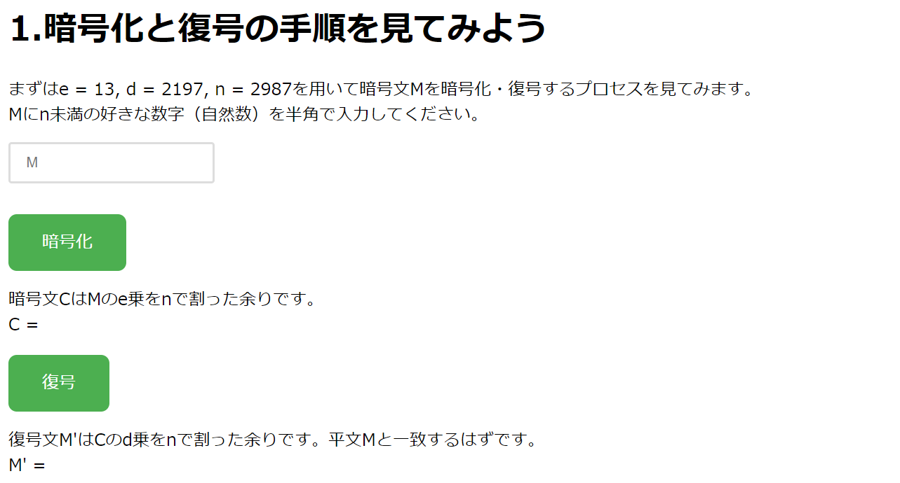
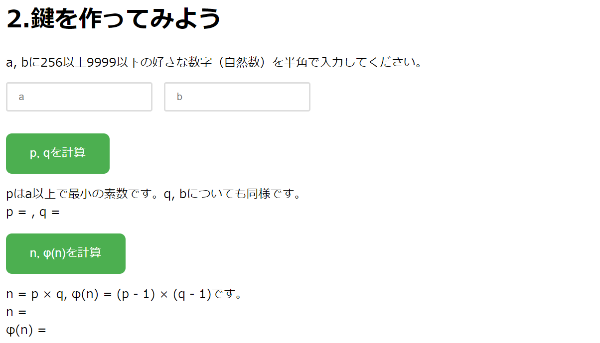
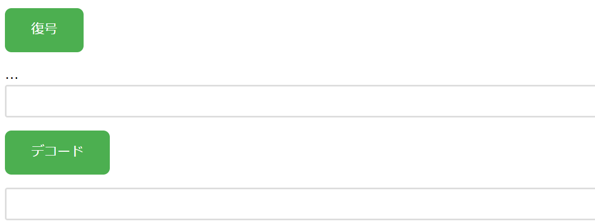

# RSA暗号

## 公開鍵暗号とは
**公開鍵暗号** とは、暗号化と復号に異なる鍵を用いる暗号方式です。暗号化に用いる鍵を**公開鍵** 、復号に用いる鍵を**秘密鍵**と呼びます。  
公開鍵は、その名の通り、誰でも知ることができる鍵です。一方、秘密鍵は、こちらもその名の通り、秘密にしておく必要がある鍵です。
公開鍵暗号を用いた通信の手順は次のようになります。  

1. 通信によって文章を受け取る側が、用意した秘密鍵を元にして公開鍵を作成し、公開する。
2. 通信によって文章を送る側が、公開されている公開鍵を用いて文章を暗号化し、送信する。
3. 受信者は、自分が持っている秘密鍵を用いて暗号文を復号し、文章を読む。

もし、秘密鍵を知らない第三者が暗号化されたデータを傍受したとしても、公開鍵から秘密鍵を求めることは困難です(逆に秘密鍵から公開鍵を作ることは容易で、上の手順で言うと 1. において受信者が実際にそれを行っています)。
したがって、公開鍵暗号を用いることで、秘密鍵を知っている第三者だけがデータを復号できるようにすることができます。

:::tip
なぜ公開鍵暗号では公開鍵と秘密鍵の両方を用いるのでしょうか？
実は、公開鍵暗号が提案されるまでは、受信者と送信者があらかじめ共通の鍵をやりとりしておき、暗号化と復号で同じ鍵を用いるという**共通鍵暗号**が使われていました。しかし、共通鍵暗号では、鍵を送る際に第三者に傍受されると、その鍵を用いて暗号化されたデータを復号されてしまうという問題がありました。  
そこで、公開鍵暗号では、鍵を送る際に第三者に傍受されても、その鍵を用いて暗号化されたデータを復号されることがないようにするために、公開鍵と秘密鍵の両方を用いるようになりました。
:::

## RSA暗号のしくみ
ここでは**RSA暗号**のしくみを説明します。
:::tip
きちんと理解するためには高校数学程度の知識が必要になります。興味がなければ、ここは読み飛ばして次の「文字コード」に進んでも大丈夫です。  
:::
RSA暗号では公開鍵と秘密鍵が複数の自然数で表されます。それらがどんな数であるかを順を追って説明します。  
まず、相異なる大きな素数 $p$ と $q$ を考えます。これらの積を $n = pq$ とします。また、
$$
\phi(n) = (p-1)(q-1)
$$
( $\phi (n)$ はオイラー関数と呼ばれます)と互いに素な自然数 $e$ を1つとります。このとき、 $e$ と $\phi(n)$ は互いに素なので、
$$
de - k\phi(n) = 1
$$
となる自然数 $k$ と $d$ が存在します。   
さて、RSA暗号では、 $e$ と $n$ を公開鍵、 $p$ と $q$ と $d$ を秘密鍵とします。このとき、平文(暗号化したい文) $M$ に対して、暗号文 $C$ は  
$$
C \equiv M^e \mod n
$$
で計算されます。送信者は公開鍵 $e$ と $n$ を使って暗号化するということです。また、暗号文 $C$ に対して、元の平文 $m$ は  
$$
M \equiv C^d \mod n
$$
で計算されます。受信者が秘密鍵 $d$ を使って復号するということです。  
$M \equiv C^d \mod n$ が成り立つのはなぜでしょうか。$C^d$を計算してみると、  
$$
C^d = M^{de} = M^{k\phi(n) + 1} = M^{k(p-1)(q-1) + 1} = (M^{k(q-1)})^{p-1} \cdot M
$$
となりますが、 $p$ が十分大きな素数であるとき、フェルマーの小定理(下のヒントを参照)より、    
$$
(M^{k(q-1)})^{p-1} = 1 \mod p
$$
です。したがって  
$$
C^d \equiv 1 \cdot M \equiv M \mod p
$$
となります。よって $C^d - M$ は $p$ の倍数です。同様にして $C^d - M$ は $q$ の倍数でもあります。したがって、 $C^d - M$ は $n = pq$ の倍数です。よって、 $C^d \equiv M \mod n$ であることがわかりました。
:::tip
フェルマーの小定理とは、 $p$ を素数、$a$ を $p$ の倍数でない整数とすると、
$$
a^{p-1} \equiv 1 \mod p
$$
が成り立つという定理です。$p$ が十分大きな素数であれば、$M < p$ となり、$M^{k(q-1)}$ は $p$ の倍数でないので、この定理を用いることができます。なお、実際にRSA暗号を用いるとき、$M$ は次で説明する文字コードの値になることから、どんな $M$ よりも大きい素数であるような $p$ を選ぶことが可能です。
:::
:::note
公開鍵 $n$ を公開してしまうと、$n=pq$ という関係から 秘密鍵の $p$ と $q$ が求められてしまうと感じるかもしれません。これは $n$ を素因数分解することと同じです。しかし、$p$ と $q$ が十分大きいとき、$n=pq$ を素因数分解することは一般には困難です。
少なくとも現在は、たとえコンピュータを用いたとしても、大きい $n$ の素因数分解にかかる時間は非常に長くかかります。
このように、RSA暗号は、素因数分解の困難性を利用した暗号方式になっています。
:::

## 文字コード
**文字コード**とは、文字をコンピュータで扱うために、文字に対応する数値を定めたものです。文字コードには様々なものがありますが、ここでは、ASCIIコードとUnicodeを紹介します。  
### ASCIIコード
**ASCIIコード**は、アルファベット、数字、記号などの文字をコンピュータで扱うために、それぞれの文字に対応する7ビットの数値(0～127の128通り)を定めたものです。  
例えば大文字の 'A' は、ASCIIコードでは 65 と定められています。  
また、小文字の 'a' は、ASCIIコードでは 97 と定められています。
ASCIIコードでは、アルファベットの大文字と小文字は、それぞれ、65 から 90 まで('A'～'Z')の数値と、97 から 122 まで('a'～'z')の数値に対応しています。  
また、'0'～'9'の数字は、それぞれ 48~57までの数値に対応しています。  
また、記号の中で、例えば '!'は 33、'?'は 63、'+'は 43、'-'は 45、'/'は 47、'='は 61 にそれぞれ対応しています。  
その他にも、改行を表す文字や、スペース、タブなどの、制御文字と呼ばれる特殊な文字にも、対応する数値が定められています。

### Unicode
ASCIIコードが扱えるのは、アルファベット、数字、およびいくつかの記号などに限られます。先ほども述べたように、ASCIIコードで使える数値は128通りしかありません。しかし、今あなたがコンピュータの画面上で読んでいる文章は、ひらがなやカタカナ、そして漢字が使われています。漢字だけでも128通りは優に超えますし、また世界には他にも多くの文字があります。  
これらの文字のように、世界中で使われている様々な文字をもコンピュータ上で扱うために、ASCIIコード以外にも色んな文字コードが考案されています。  その代表的な規格として **Unicode** があります。Unicode の文字に対応する数値を定める方式として、UTF-8、UTF-16、UTF-32などがありますが、ここでは **UTF-8** について説明します。
#### UTF-8    
UTF-8では、8ビットの値(0～255)を1つの符号単位として、1～4の符号単位を用いて1つの文字を表します。  
例えばASCIIコードにもあった'A'は、1つの符号単位を用いて 65 と表されます(ASCIIコードと同様)。  
また、ひらがなの'あ'は、3つの符号単位を用いて 227, 129, 130 と表されます。  
さらに絵文字を表すこともでき、例えば'😊'は、4つの符号単位を用いて 240, 159, 152, 138 と表されます。 

## RSA暗号の使い方
RSA暗号の使い方を説明します。先ほども述べたように、RSA暗号では公開鍵 $e$ と $n$ 、および秘密鍵 $p$ と $q$ と $d$ を用います。ここでは、
$$
e=13, n=2987, p=29, q=103, d=2197
$$
とします(「RSA暗号のしくみ」を読んだ人は、これらが $n=pq$ などの条件を満たしていることを確認してみるとよいでしょう)。では、これらの鍵を用いて "こんにちは" という文字列を暗号化し、できた暗号を復号してみましょう。  
### エンコード
まず、UTF-8を用いて "こんにちは" を数字の列に変換します。このことを**エンコード**といいます。'こ'は、 227, 129, 147 に変換されます。'ん'は、 227, 130, 147 に変換されます。以下同様に変換していくと、"こんにちは"は全体として 
$$
227, 129, 147, 227, 130, 147, 227, 129, 171, 227, 129, 161, 227, 129, 175
$$
に変換されます。  

### 暗号化
続いて**暗号化**を行います。暗号化では、エンコードによって得られた数をそれぞれ $e$ 乗して、 $n$ で割った余りを求めます。例えば、最初の 227 は、227 の 13 乗を 2987 で割った余りを計算することになります。これは手計算で行うのは大変ですが、コンピュータや電卓を使って計算すると 1821 になることがわかります。同様にして、2つ目以降の数についても 13 乗して 2987 で割った余りを計算すると、全体として
$$
1821, 328, 2740, 1821, 2612, 2740, 1821, 328, 2910, 1821, 328, 2833, 1821, 328, 1451
$$
となります。つまり、これが "こんにちは" を暗号化したものになります。  

### 復号
次に、この暗号を**復号**します。復号では、数を $d$ 乗して $n$ で割った余りを求めます。例えば、最初の 1821 は、1821 の 2197 乗を 2987 で割った余りを計算することになります。これもコンピュータや電卓を使って計算すると、 227 になることがわかります。同様にして、2つ目以降の数についても 2197 乗して 2987 で割った余りを計算すると、全体として
$$
227, 129, 147, 227, 130, 147, 227, 129, 171, 227, 129, 161, 227, 129, 175
$$
となります。つまり、これが "こんにちは" を復号したものになります。  

### デコード
最後に、これらの数を文字に変換します。つまりエンコードの逆の操作を行います(これを**デコードと**いいます)。復号した結果の最初の3つの数は 227, 129, 147 ですが、これは 'こ' に対応する数です。同様にして、2つ目以降の数についてもデコードすると、全体として"こんにちは"となります。よって、RSA暗号を用いて文字列を暗号化し、復号することができました。

## 実際にやってみよう
それでは、実際にRSA暗号を用いて文字列を暗号化し、復号してみましょう。
[RSA暗号](https://kf74-rsa.pages.dev/)にアクセスしてください。次のような画面が表示されます。

<a href="https://kf74-rsa.pages.dev/" target="_blank" rel="noreferrer" className="button button--primary button--block">RSA暗号を体験できるサイトを開く</a>

まずは指示に従って、$M$ に $n$ 未満の好きな数を入れましょう。その後、「暗号化」のボタンをクリックすると、$C$ に $M$ の $e$ 乗を $n$ で割った余りが表示されます。続いて、「復号」のボタンをクリックすると、$M'$ に $C$ の $d$ 乗を $n$ で割った余りが表示されます。  
すると、$M$ と $M'$ が一致することがわかります。今は $M$ はただの数なのであまり実感は沸かないかもしれませんが、$M$を暗号化したもの($C$)を復号するとちゃんと $M$ に戻っていることがわかります。  
次に2番に進みます。

先ほどはRSA暗号の鍵が与えられていましたが、ここでは鍵を作ってみましょう。$a$ と $b$ に、256～9999の好きな数を入力し、「$p, q$ を計算」のボタンをクリックしてください。すると、$p$ と $q$ が表示されます。
このとき表示される $p$ は $a$ 以上の素数のうち最小のものです。同様に、$q$ は $b$ 以上の素数のうち最小のものです。ただし、$p$ と $q$ は同じ数になってしまった場合は、自動的に再計算されて異なる数になります。なお、$p$ と $q$ が文字コードの値よりも大きくなるようにするために、$a$ と $b$ は256以上の数に限定しています。
続いて、「$n, \phi(n)$ を計算」 のボタンをクリックすると、先ほどの $p$ と $q$ から $n$ と $\phi(n)$ が計算されます。

次に、「$e$ を計算」のボタンをクリックすると、$\phi(n)$ と互いに素な $e$ が計算されます。ここではそのような $e$ のうち最小のものが表示されます。
最後に、「$d$ を計算」のボタンをクリックすると、$e$ を $\phi(n)$ で割った余りとして $d$ が計算されます。  
これで、RSA暗号の鍵がすべて揃いました！ それでは3番に進みましょう。

まず、先ほど決めた鍵である $e$、$d$、$n$ を入力し、また暗号化したい文字列を入力します。
次に、「エンコード」のボタンをクリックすると、文字列がエンコードされて数の列に変換されます。
そして、「暗号化」のボタンをクリックすると、エンコードされた数の列が暗号化されます。

次に、「復号」のボタンをクリックすると、暗号化された数の列が復号されます。
最後に、「デコード」のボタンをクリックすると、復号された数の列が文字列に変換されます。
元の文字列に戻りましたか？ もし戻っていなければ、鍵の入力が正しいか確認し、やり直してみましょう。

ここまで、RSA暗号について学び、実際に使ってみました。これでみなさんも、RSA暗号を用いて文字列を暗号化し、復号することができるようになりました。おめでとうございます！
