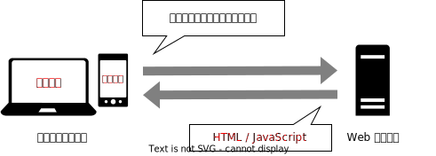

import { Sandpack } from "@codesandbox/sandpack-react";

# ほかのユーザーを妨害しよう

Web サービスに対する攻撃は、データベースの中を覗こうとするものに限りません。
XSS は、Web が動作する仕組みを巧妙に悪用し、同じ Web サービスを使う別のユーザーに攻撃する手法です。

## ブラウザと HTML・JavaScript

パソコンやスマートフォンを用い、インターネットで調べ物をしているとき、あなたは何というアプリを使っていますか？
iPhone を使っている方は Safari を、Android を使っている方は Google Chrome を、Windows を使っている方は Microsoft Edge を使うことが多いのではないでしょうか。

Safari や Google Chrome のように、ウェブサイトを見るためのソフトウェアを**ブラウザ**と呼びます。
どのブラウザを使っても同じようにウェブサイトが動作するのは、このブラウザと呼ばれるソフトウェアの動作が、国際機関によって標準化されているためです。

これまでに見てきたように、あなたがウェブサイトを見ようとしたとき、ブラウザはあなたの意思に応えて Web サーバーにウェブサイトのデータを送るよう要求します。

このとき、Web サーバーがブラウザに対して送り返すデータは、**HTML** や **JavaScript** といったプログラミング言語で記述されています。
この HTML や JavaScript をブラウザが解釈して実行することにより、ウェブサイトは動作しているのです。



## HTML と JavaScript の基礎文法

ウェブサイトで使われる言語である HTML と JavaScript は、それぞれ次のような異なる役割を持ち、互いに協調して動作します。
それぞれの言語の書き方を見ていきましょう。

- HTML: ウェブサイトの構造を表現する
- JavaScript: HTML から参照され、ウェブサイトに動きを加える

### HTML

次の HTML は、画面に「Hello <strong>World</strong>」と表示するプログラムです。

<Sandpack
  files={{ "/index.html": "Hello <strong>World</strong>" }}
  theme="light"
  template="static"
/>

HTML における `<` から始まり `>` で終わる部分は、**タグ** と呼ばれます。
タグはそれぞれに固有の意味を持ち、 `<tag>内容</tag>` のように、タグ名の先頭にスラッシュを付けるか否かの区別により開始タグと終了タグに分かれ、内部にテキストや別のタグを挟み込むことができます。

上の例では、テキストの一部分を強調するための `<strong>` タグを使用しているため、`World` の部分が太字で表示されました。

### JavaScript

JavaScript は、`<script>` タグの中に記述します。

```html title="HTML"
Hello
<script>
  document.write("World");
</script>
```

この例では、`document.write("World");` の部分が JavaScript になっています。
